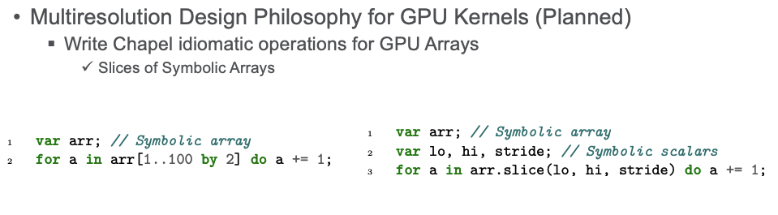

ChapelCL WIP
========

OpenCL Wrapper for Chapel

**Example of a GPU Kernel**

To serve as an example as to why we are generating C code and how it relates to GPU Kernel generation...

```c
__kernel void vector_add(__global const int *A, __global const int *B, __global int *C) {
 
    // Get the index of the current element to be processed
    int i = get_global_id(0);
 
    // Do the operation
    C[i] = A[i] + B[i];
}
```

**No language/compiler changes needed, just OpenCL!**





